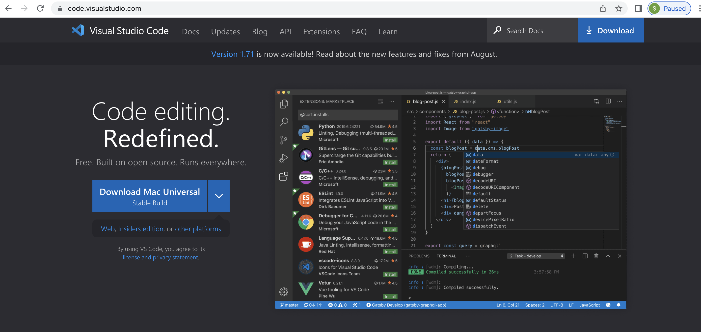
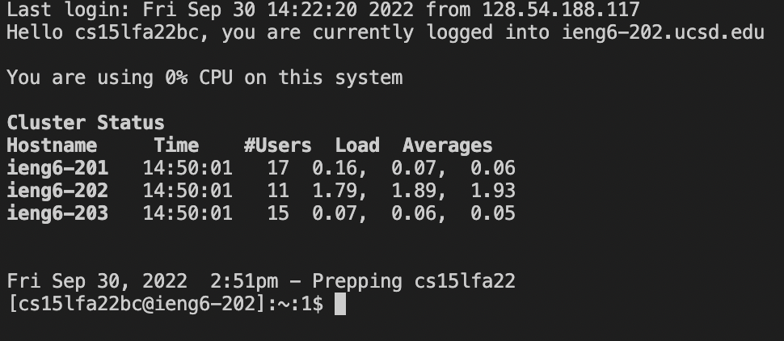
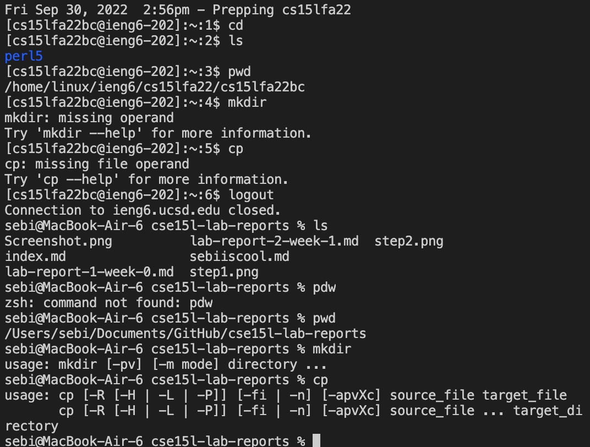
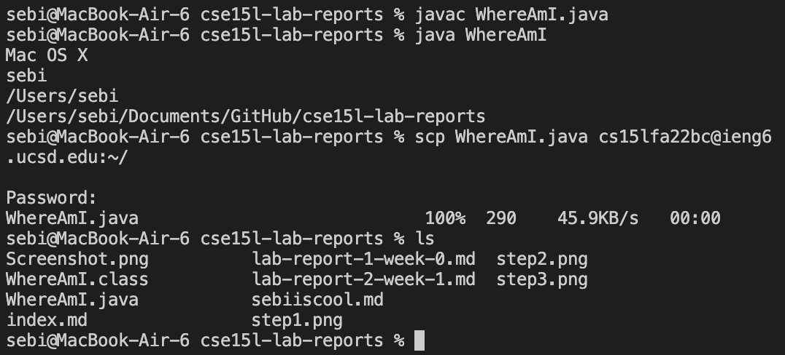
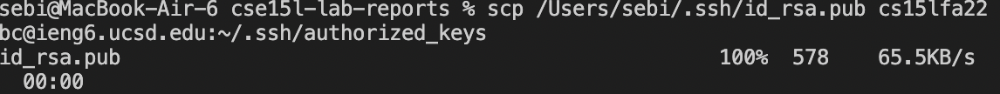
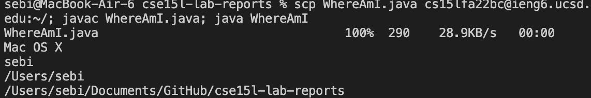

# Hi, welcome to this Tutorial!
## This will teach you how to access the remote server on a Mac

**Step 1:**
Installing Visual Studio Code

To download visual studio code, go to code.visualstudio.com and click the download button. 

**Step 2:**
Remotely connecting.

To Remotely connect, you must have your account number and password on hand. 

To obtain your account number/change your password, go here: https://sdacs.ucsd.edu/~icc/index.php

Open a terminal in VSCode. Click terminal in the toolbar and then click 'New Terminal.'

Type:

ssh cs15lfa22zz@ieng6.ucsd.edu

where zz is your specific account characters.

You should be prompted to enter a password, and after doing so should see something similar:

If you see a similar screen then you have gained access to the remote server. 

**Step 3:**
Trying some commands

Try running some commands such as cd, ls, pwd, mkdir, and cp. Run them a few tiems, on your computer and on the remote server.

*To exit the remote server, type exit or control-D*

You may see something like this:

**Step 4:**
Moving files with scp

scp can be used to copy a file from your computer to a remote computer. 

Create a file on your computer called WhereAmI.java with the following contents.

>class WhereAmI {
  public static void main(String[] args) {
    System.out.println(System.getProperty("os.name"));
    System.out.println(System.getProperty("user.name"));
    System.out.println(System.getProperty("user.home"));
    System.out.println(System.getProperty("user.dir"));
    }
}

Use the commands javac and java on the file to compile, and run it. Then run this command

>scp WhereAmI.java cs15lfa22zz@ieng6.ucsd.edu:~/

You'll be prompted to enter your password. After doing so, type ls and you can see the new file in your remote directory!

**Step 5:**
Setting a SSH key

An SSH key stores a file on the remote server as well as on your computer. These pair of files can be used in place of your password. 

On client:

>ssh-keygen

Press enter twice to save the files to the default location.

>mkdir .ssh

>exit

On client:

>$ scp /Users/joe/.ssh/id_rsa.pub cs15lfa22@ieng6.ucsd.edu:~/.ssh/authorized_keys

Substitute your given directory and username in the line above.

As you can see in the screenshot above, a password is no longer necessary. This means you can save a lot of time in logging in. 

**Step 6:**
Making remote running even more pleasant

You can make this process even more efficient! Instead of writing multiple lines, you can write everything in one line. For example, 

>ssh cs15lfa22@ieng6.ucsd.edu "ls"

will show the directory of your remote server with only one line. Using this logic you can move a file to the remote server, compile it, and run it, all in one line!

