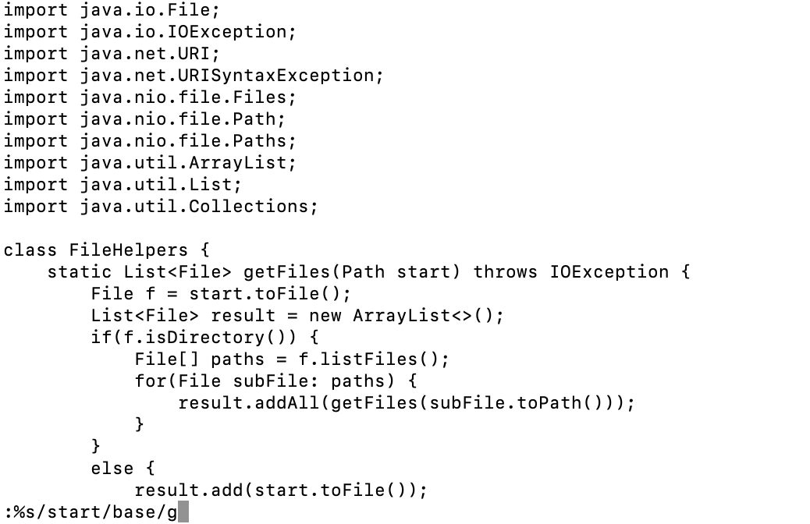
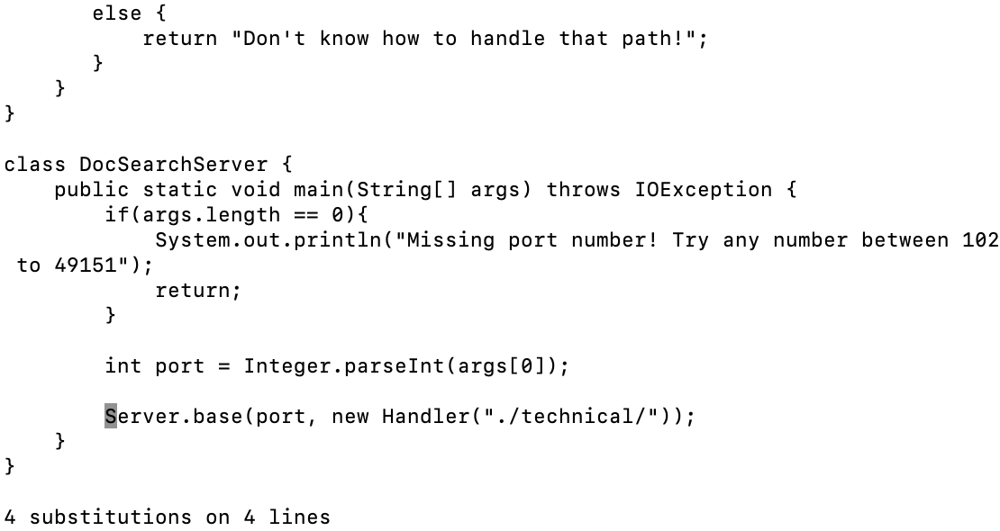
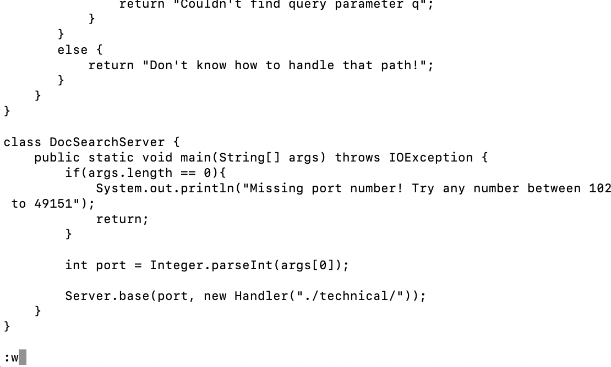

# **Week 6 Lab Report**

# Part 1: How to find and replace

To open DocSearchServer.java and make changes I opened terminal and navigated to its directory and then inputted the following command:

<pre><code>
$ vim DocSearchServer.java
</code></pre>

Once I was in, I wanted to change all instances of the word "start" to the word "base". In order to do this I pressed the following characters: 

<pre><code>
:%s/start/base/g
</code></pre>

For a total of 16 keys pressed.

This is what it looked like in my terminal:

:/$s/start/base/g

I then pressed `<enter>`

This led me to this screen: 

This tells me that the 4 subsitutions were made. 

Then, I just needed to commit the changes using

`:w`

And then pressed `<enter>` once again to save this.

In total I pressed 19 keys to find and replace all instances of 'start' with 'base'.

# Part 2: Comparing VIM and VSC

Using VSC, I cloned the directory and was able to make the changes and upload to the directory in 3 minutes and 22 seconds. 

Using VIM, I was able to acces the file in the remote server directly and achieved this change in 1 minute and 43 seconds. 

Comapring the two it's clear that VIM was faster. Although Visual Studio Code feels more intuitive to me still, I think VIM is quite a bit more effiicent. 

If I were working on a file remotely I'd prefer to use VIM for quick changes. I am however much more comfortable in VSC (which could change). If I were making large changes I would most likely prefer to use VSC since it's much more user friendly and provides more support when coding. Also, I think if I'm working on a project with numerous files it'd be a lot easier to use VSC. 

